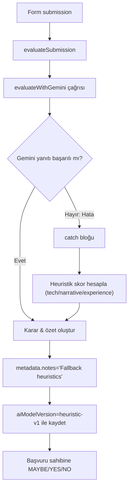

# Gemini Fallback

```mermaid
flowchart TD
  A[Form submission] --> B[evaluateSubmission]
  B --> C["evaluateWithGemini çağrısı"]
  C --> D{"Gemini yanıtı başarılı mı?"}
  %% Evet kolunu açıkça çizmek isterseniz bir sonraki satırı kullanın
  D -->|Evet| G["Karar & özet oluştur"]
  D -->|"Hayır: Hata"| E["catch bloğu"]
  E --> F["Heuristik skor hesapla (tech/narrative/experience)"]
  F --> G["Karar & özet oluştur"]
  G --> H["metadata.notes='Fallback heuristics'"]
  H --> I["aiModelVersion=heuristic-v1 ile kaydet"]
  I --> J["Başvuru sahibine MAYBE/YES/NO"]

```
